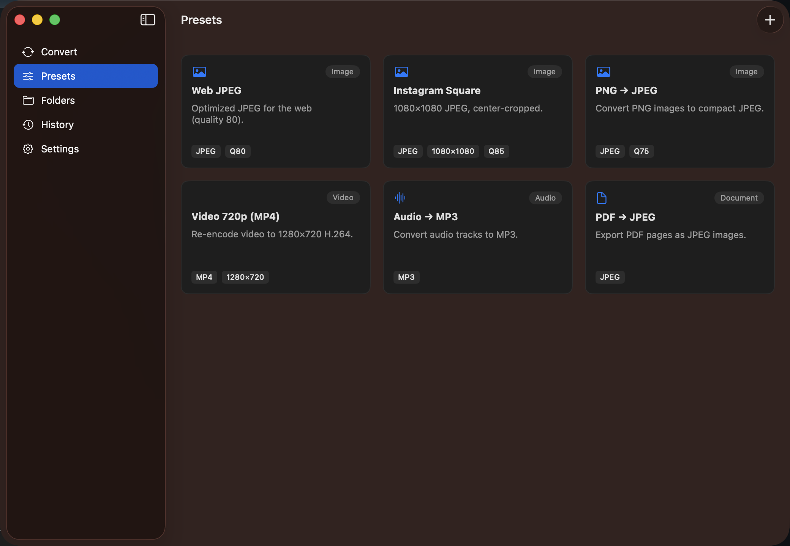

<div align="center">

# 🔨 Forge

> ⚠️ Alpha — in active development. Not ready for daily use yet.

**A fast, native macOS app for batch file conversion — no dependencies, no bloat.**

Drag in hundreds of images, videos, audio files, or PDFs. Pick a preset. Convert them all — in parallel, with RAM kept low by streaming. 100% Apple frameworks (Core Image, AVFoundation), zero external tools.

[](https://github.com/thousandflowers/Forge/actions/workflows/build.yml)
[](https://swift.org)
[](https://developer.apple.com/macos)
[](LICENSE)



</div>

## Why Forge

- **Native & dependency-free** — Core Image + AVFoundation do the work. No ImageMagick, FFmpeg, or LibreOffice to install. It just runs.
- **Batch-first** — drop hundreds of files, convert them in bounded parallel waves that respect your concurrency setting.
- **Memory-conscious** — streaming conversion keeps RAM flat even on large video.
- **Watched folders** — assign a preset to a folder; anything dropped in is converted automatically (FSEvents).
- **Presets & history** — reusable transformation pipelines, full processing history, JSON-backed (no Core Data).

## Supported formats

| Kind | Read | Write | Operations |
|------|------|-------|-----------|
| **Image** | JPEG, PNG, TIFF, HEIC, WebP, BMP, GIF, TGA, ICO | JPEG, PNG, TIFF, HEIC… | convert · resize (4 modes) · quality · filters |
| **Video** | MP4, MOV, M4V, AVI, MKV, WebM | MP4, MOV, M4V (H.264) | convert · resolution · bitrate/quality |
| **Audio** | MP3, WAV, M4A, AAC, FLAC, ALAC, AIFF | MP3, M4A, WAV, AAC, FLAC | convert · bitrate · sample rate · channels |
| **Documents** | PDF, TXT, CSV, HTML, RTF | images (JPEG/PNG/TIFF), text | PDF → images · basic text conversions |

## Install

### Download (recommended)
Grab the latest `.dmg` from the [**Releases page**](https://github.com/thousandflowers/Forge/releases), open it, and drag **Forge** to Applications.

> Unsigned build: on first launch, right-click the app → **Open** to bypass Gatekeeper.

### Build from source
```bash
git clone https://github.com/thousandflowers/Forge.git
cd Forge
swift build -c release
.build/release/Forge
```
Requires macOS 13+ (Ventura) and Swift 5.9+.

## Usage

**Batch convert**
1. Launch Forge, drag & drop files into the window.
2. Pick a preset (e.g. *Instagram Post*), choose destination (Overwrite / Copy to / Move to).
3. Click **Start Processing**.

**Watched folder**
1. Open the **Folders** tab, add a folder, assign it a preset.
2. Anything dropped in that folder is converted automatically.

**Custom preset**
1. **Presets** tab → **+**.
2. Set target format, resize, quality (1–100), optional filter. Save — it's now usable in batch and watched-folder modes.

## Architecture

```
SwiftUI  ──▶  ProcessingCoordinator  ──▶  ProcessorRegistry  ──▶  Image / Video / Audio / Doc processors
                     │                                                    (Core Image · AVFoundation · PDFKit)
              bounded TaskGroup                             MonitoredFolderWatcher (FSEvents)
              (maxConcurrentNative)                         PersistenceManager (JSON in App Support)
```

- **ProcessorRegistry** picks the right processor for each file type.
- **ProcessingCoordinator** runs conversions, tracks active tasks for cancellation.
- **RulePreset** — serializable transformation pipelines.
- **PersistenceManager** — JSON storage for presets, history, monitored folders.

## Development

```bash
swift test                 # run the unit suite
bash Scripts/generate_samples.sh   # generate sample test files
```

## Roadmap

- [x] Native image / video / audio / PDF conversion
- [x] Bounded-concurrency batch processing with live progress
- [x] Presets, processing history, JSON persistence
- [ ] Watched-folder UI polish + completion notifications
- [ ] Preset import/export
- [ ] CLI (`forge`) + Shortcuts integration

## Contributing

PRs welcome. Fork → feature branch → tests green (`swift test`) → PR. Follow the Swift API Design Guidelines, keep memory bounded (stream, don't fully load), use async/await + actors.

## License

MIT — see [LICENSE](LICENSE).

## Acknowledgments

Built with Core Image, AVFoundation, and SwiftUI. Inspired by the original [Shift](https://github.com/livshitz/shift) — this is a native, from-scratch rebuild.
