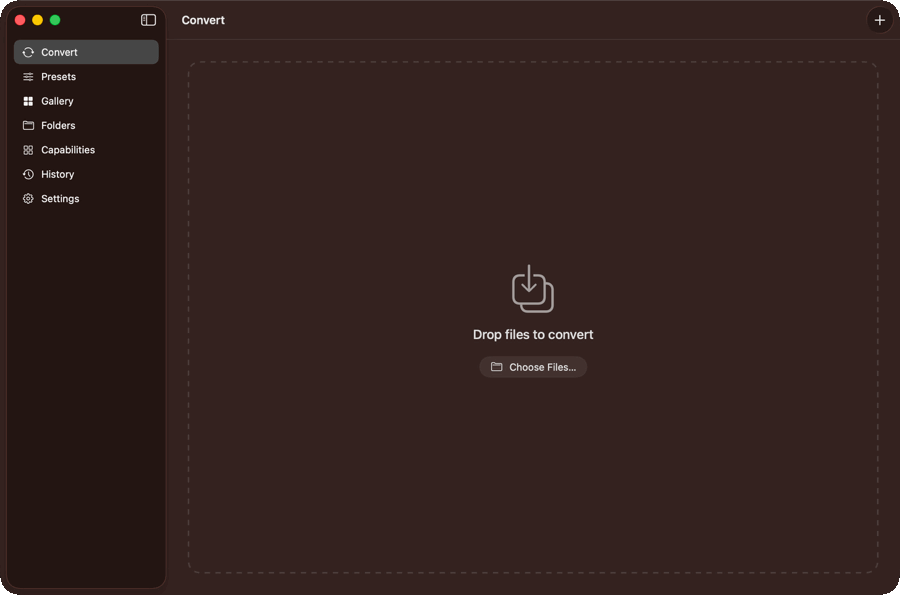
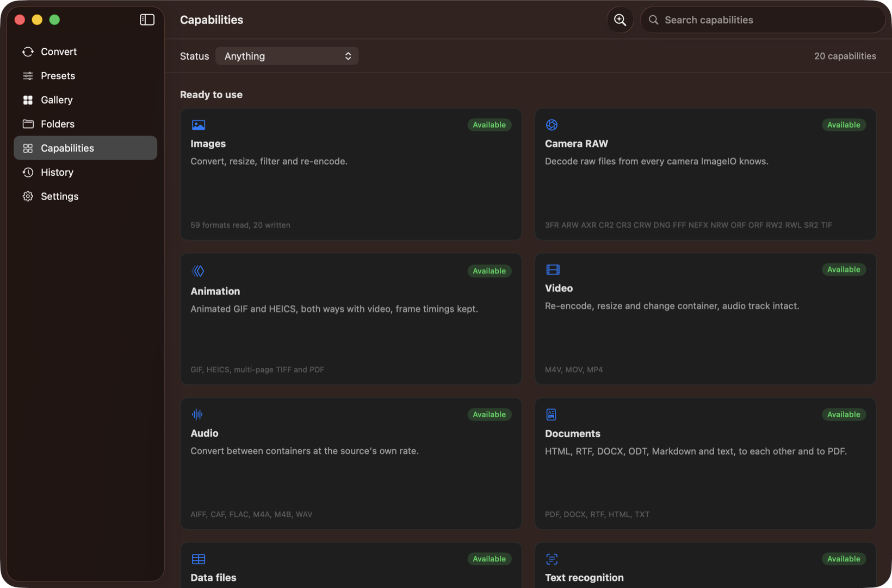
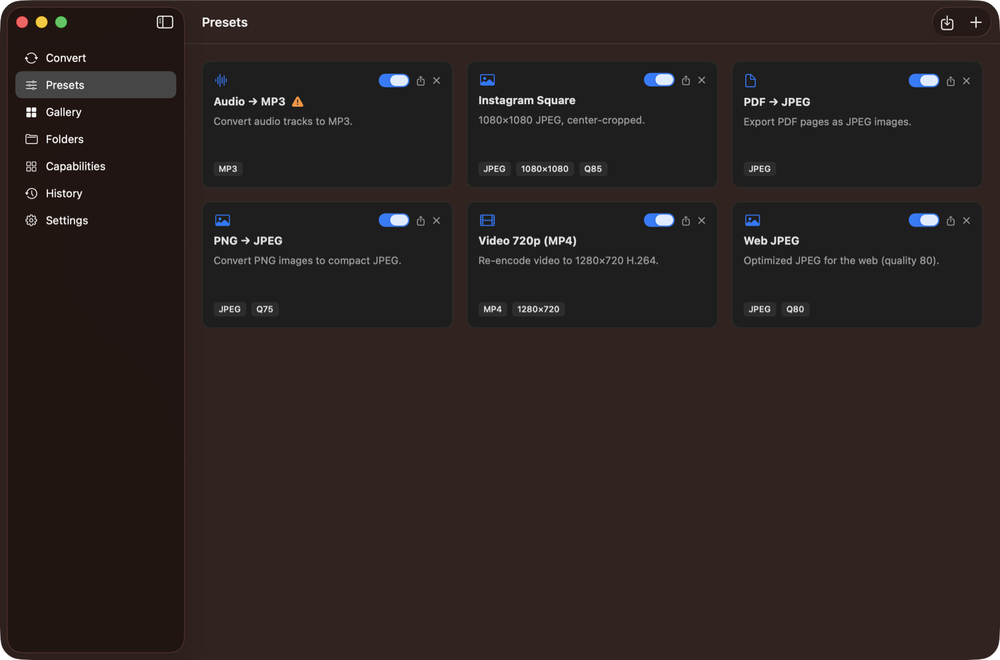
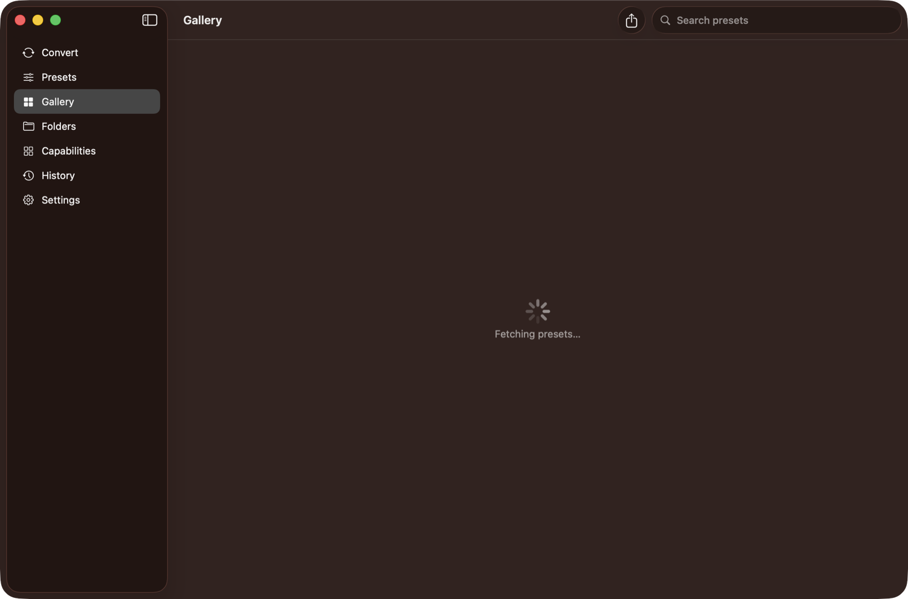

<div align="center">


# Forge

**Batch file conversion for macOS. Photos, video, audio and PDFs, converted by the frameworks already on your Mac.**



Drop in a folder of photos, a video, a stack of PDFs. Forge asks what they should become, in the terms of what they are, and converts them in parallel without loading them all into memory. It is one binary that is both a Mac app and a command line tool, it works with Core Image, AVFoundation, PDFKit and Vision, and it asks macOS what this particular machine can read and write — so it never offers a conversion it cannot finish.

[](https://github.com/thousandflowers/Forge/actions/workflows/build.yml)
[](https://swift.org)
[](https://developer.apple.com/macos)
[](LICENSE)

> Alpha. It works, it is tested, and it is still changing week to week.

</div>

## Drop the files, and answer a question only when there is one

The Convert screen is a drop zone. The first time, Forge asks what the files should become. After that it mostly does not ask at all: **drop a folder onto the preset you chose a minute ago and it just runs.**

Every conversion is read as five facts — is something being thrown away, did you ask for that yourself, is anything still undefined, does this make a different kind of thing or more files than it was given, does it touch the originals — and those five decide between running it, asking once, and the confirmation that has always guarded your originals. A size you typed into a filename counts as your own answer, so `holiday_10MB.jpg` runs without a word. The same ceiling arriving from a preset does not: that gets one sober popup which converts a single representative file into a scratch folder and shows you the before and the after, measured rather than guessed.

When it does ask, it asks the right question for the files in hand:

- a **photo** gets format, size, quality, a look, and reading the text out of it
- a **video** gets format, resolution, codec, frame export and a transcript
- an **audio file** gets format, codec and a transcript
- a **PDF** gets format, page size, quality, a filter, and a voice to read it aloud
- a **CSV or JSON** gets one thing only, another data format, because that is all its processor accepts

A control that would be ignored is not shown. If it is on screen, something honours it.



## Presets are a starting point, not a mode



Pick a preset in the sheet and its settings fill in the fields below. Change any field and the preset lets go, because from that point the fields are the truth. Leave it alone and the preset runs exactly as saved, which matters when it holds something the sheet has no control for.

A preset can also **ask a question instead of deciding one**. Give it a parameter, say a maximum size, and Forge asks for the number when you convert rather than baking it in. The answer can go into the filename: name your files `{name}_{maxsize}` and a holiday photo comes out as `holiday_10MB.jpg`.

Choosing **more than one output format** does not replace the first with the second. It makes both, one copy per format, each with the rest of the chain applied.

## The magic conversions

Some conversions are not settings, they are things Forge works out from what you asked:

| You do this | Forge does this |
| --- | --- |
| Rename a file `holiday_10MB.jpg` | Compresses it under ten megabytes, keeping the best quality that fits |
| Convert a video to JPEG or PNG | Exports every frame, into a folder named after the clip |
| Convert a video to GIF | Turns the clip into an animated GIF, and a GIF back into video |
| Convert a recording to `.txt`, `.rtf`, `.docx` or `.pdf` | Transcribes it on device, into that format |
| Convert a scan or a photo to text | Reads it with Vision, on device |
| Convert a document to `.m4a` or `.wav` | Reads it aloud with a system voice |
| Convert a PDF to an image | Rasterises every page, not just the first |

The size ceiling is a promise about the result, not a setting handed to an encoder. Forge writes the file, measures it, and writes it again lower until it fits, spending quality first and pixels only after that runs out. If it truly cannot reach your number it says so, instead of handing back something unrecognisable that happens to be small.

## Capabilities, and what to do about the gaps

The Capabilities screen is computed at run time, so it describes your Mac rather than a claim written months ago. Search it, filter it by status, and ask it to **look at the files you actually have**: it counts the kinds of file in your own folders and puts the capabilities that would help you at the top. Only filenames are read, never contents, and only when you press the button.

Every conversion above is Apple's frameworks and nothing else: no ImageMagick, no FFmpeg, no LibreOffice, and nothing to install before Forge is useful. For the handful of jobs macOS cannot do alone, Forge names the tool that can and offers to add it — as an **extension**, which is a separate download and never part of the app.

Two ways one can arrive. **Homebrew**, which works today: the exact command is shown once before it runs, with its output live on the card, and the tool is your Mac's rather than Forge's. Or an **extension** Forge hosts and pins — the machinery for that is built and tested, and it turns on for a tool the day a build for it is published on the Releases page. When one is, the card tells you the version, the licence, the project it comes from and how large it is before anything happens; what arrives is checked against a SHA-256 checksum from the manifest and thrown away if it does not match, then unpacked into `~/Library/Application Support/Forge/Extensions/` — not into the app, not onto your `PATH` — and removable from the same card. `forge extensions list | add | remove` does the same from a script, and `FORGE_EXTENSIONS_MANIFEST` points it at a manifest of your own.

What stays true either way: **the core converts with Apple's frameworks and nothing else**, no extension is needed for any of it, and no third-party binary is bundled inside the `.app`. What is no longer true is the older claim that Forge downloads nobody's binaries — it will download the ones you ask it for, from its own releases, with the checksum checked.

Install `cwebp`, `pandoc`, `ffmpeg` or `tesseract` and the formats they add appear where a processor will really do the writing: WebP out of the image path, EPUB and the office formats out of pandoc, the containers macOS cannot write out of ffmpeg. The cards say which of the two facts is true for each — whether the tool is here, and whether Forge calls it — because those are different things.

## How it compares

Forge is not trying to out-encode a specialist. HandBrake has spent twenty years on video and will beat Forge at video; ImageOptim squeezes PNGs harder than ImageIO does. What Forge has is breadth, nothing to install first, and presets that travel.

| | Forge | Permute | HandBrake | ImageOptim |
| --- | --- | --- | --- | --- |
| What it converts | images, video, audio, PDF, data, 3D, subtitles | images, video, audio | video, and the audio inside it | images |
| Where the converters come from | macOS itself, plus optional extensions you ask for | bundled with the app | bundled with the app | bundled with the app |
| What it offers is read from your Mac at run time | yes | no | no | no |
| Presets you can export, import and browse in a gallery | yes | presets, kept local | presets, importable files | no |
| Strips location and device metadata on conversion | yes, three levels | no | no | keeps or strips, all or nothing |
| Command line | the same binary | no | separate `HandBrakeCLI` | no official one |
| Licence | MIT | paid, closed | GPL-2.0 | GPL-2.0 |


## A gallery you can search



Presets other people published, searchable by name, by author, by topic, and by what they actually do, so typing `jpeg` finds the ones that write JPEG rather than only the ones that say so. Filter by type, by output size, or by topic. Every card hands you that one preset as its own file, and your own presets do the same.

A preset is data, not code. It is a name and a list of actions Forge already knows how to run, so installing one cannot make the app do anything it could not already do.

## Names that say what the file turned out to be

A template names the files a conversion writes, and the field shows you what they will be called as you type it:

`{name}` `{parent}` `{date}` or `{date:yyyy-MM-dd}` `{counter}` or `{counter:03}` `{format}` `{quality}` `{codec}` `{width}` `{height}` `{dimensions}` `{size}`

The last few are only true once the file exists, so they are filled in afterwards: `{name}_{dimensions}` gives `holiday_400x300.jpeg`, measured from the file that was actually written. A token Forge does not recognise is left where it is, because a typo you can see is one you can fix.

## General preferences, and overriding them

Settings holds what resizing means (fit inside, fill and crop, stretch, pad out), the quality to use when a preset names none, how much of the metadata survives, and how new files are named. Each one is what happens when nothing else says otherwise. A preset overrides the general preference, a batch overrides the preset, and what you write into a filename overrides all of it.

## What leaves with your files

A photograph carries where it was taken, which camera took it, and often the serial number of the lens. A PDF carries who wrote it. None of that is the picture or the document, and all of it travels when you send the file to somebody.

Three levels — keep everything, remove the location, remove what identifies a person, a device or a moment — available from Settings, from a preset, from a batch, or by naming a file `contract_privacy.pdf`. They combine: `holiday_10MB_privacy.jpg` compresses **and** strips.

What is never removed, at any level, is the colour profile and the orientation. Those are not information about you: without them the photograph arrives on its side, in the wrong colours.

Separately, and never automatically: Forge can look through a picture with Vision and Natural Language and **suggest** faces and names to cover up. It misses things — a face turned away, handwriting, a name in a reflection — so every box starts unticked, nothing is covered until you tick it, and the copy is written somewhere you choose. It is assistance, not anonymisation, and the app says so where you cannot miss it.

## History you can run again

A row in History knows what it did, not just which preset did it, so it can be **saved as a preset** — the same thing said the other way round, indistinguishable from one you made by hand — or run again on files you pick now, or run again on the same files. That last one is careful: an original that has moved is named rather than skipped in silence, and a run that replaced its original goes through the replace confirmation again rather than around it.

## Careful with your files

- Conversions are written to a scratch file and moved into place, so nothing is ever read and written at the same path.
- Output names never collide silently. Two files heading for one name both arrive.
- Converting in place keeps a copy of the original in Backups, unless you turn that off.
- Replacing or moving originals asks first, and says how many files and whether anything can be got back.
- A watched folder ignores the files Forge itself writes, so pointing the output back at the input does not start a loop.
- A cancel reaches the work, not just the queue: the scratch file goes with it and the original is untouched. One file can be stopped without stopping its siblings.

## It does not take the Mac down with it

How much runs at once is worked out per kind of work, from the cores, the memory and whether this is Apple silicon. Two videos at a time is one too many — the media engine is a single piece of hardware and asking it for two only makes heat — while two images at a time is far too few on a machine with ten cores, and images are bounded by memory rather than cores, because a decoded photograph is a quarter of a gigabyte.

It backs off while a batch is running. A warm Mac, Low Power Mode or memory pressure shrinks the limits, and the screen says so rather than just getting slower. **Pause** stops new files starting and lets the ones in flight finish; a native encode cannot be frozen halfway, and a button claiming otherwise would be lying.

## Install

### Download

Grab the latest `.dmg` from the [Releases page](https://github.com/thousandflowers/Forge/releases), open it, drag Forge to Applications. Universal build, Apple silicon and Intel, macOS 13 Ventura or later.

The build is unsigned, so on first launch right click the app and choose Open.

### Homebrew

```bash
brew install --cask thousandflowers/tap/forge
```

### From source

```bash
git clone https://github.com/thousandflowers/Forge.git
cd Forge
./Scripts/build_app.sh      # produces build/Forge.app
open build/Forge.app
```

`swift build` on its own produces a bare executable with no bundle, and macOS treats that as a background agent: it runs, but no window ever appears. Use the script, which assembles the real app bundle.

## Command line

The same binary is also `forge`:

```bash
ln -s /Applications/Forge.app/Contents/MacOS/Forge /usr/local/bin/forge
```

```bash
forge convert *.png --to jpeg --quality 80 --out ./web
forge convert photo.heic --preset "Web JPEG" --out ~/Desktop
forge convert *.png --to jpeg --overwrite          # keeps a backup
forge watch ~/Desktop/incoming --preset "Web JPEG" --out ~/Desktop/web

forge presets              # the same presets the app shows
forge formats              # what this Mac can read and write
```

It reads the presets you save in the app, writes to the same history, and exits non zero if any file failed, so it drops straight into a script. Converted paths go to stdout, problems to stderr:

```bash
forge convert *.heic --to jpeg --out ./web --quiet > converted.txt
```

Completions come from the tool itself: `forge --generate-completion-script zsh` (or `bash`, or `fish`).

## Watched folders

Open the Folders tab, add a folder, give it a preset. Anything dropped in is converted on arrival, through FSEvents, with the same care about backups and names as everything else.

## How it fits together

```
SwiftUI  ──▶  ProcessingCoordinator  ──▶  Image / Media / Document / Data / Model processors
                     │                     (Core Image · AVFoundation · PDFKit · Vision · ModelIO)
              output planning              MonitoredFolderWatcher (FSEvents)
              scratch file, atomic move    PersistenceManager (JSON in Application Support)
```

- **FormatCatalog** asks ImageIO and AVFoundation what this machine can read and write. Nothing is offered that cannot be delivered.
- **ConvertKind** decides which controls a dropped file is worth being shown, taken from what its processor honours rather than from what sounds plausible.
- **ProcessingCoordinator** picks the processor, fills in the general preferences the preset left unsaid, runs the chain once per requested format, names the output from its template, and keeps every write off files you already have.
- **ExternalTools** notices the converters your Mac already has, and installs one when you ask.
- **PersistenceManager** stores presets, history and folders as plain JSON.

## Development

```bash
swift test                         # the whole suite
./Scripts/build_app.sh             # build build/Forge.app
./Scripts/make_dmg.sh              # package it as a DMG
```

Tests build their fixtures at run time and keep everything in a scratch directory, so running them never touches the data the app keeps for you.

## What is not here yet

- Translating subtitles into another language. macOS 13 has no offline translation API, and sending your files to somebody's server is not something this app is going to start doing quietly.
- No extension builds are published yet. The whole path — manifest, checksum, install, removal — is built and tested, and the Capabilities cards offer Homebrew until there is something to download.
- Redaction suggests; it never decides. There is no mode that covers faces without you looking at each one, and there will not be.
- Signing and notarization.

See [docs/ROADMAP.md](docs/ROADMAP.md) for the longer list, including what Forge will not do and why.

## Contributing

Fork, branch, keep `swift test` green, open a PR. Follow the Swift API Design Guidelines, keep memory bounded by streaming rather than loading, use async/await and actors.

## License

MIT. See [LICENSE](LICENSE).

Built with Core Image, AVFoundation, PDFKit, Vision and SwiftUI. Inspired by the original Shift, rebuilt from scratch as a native app.
